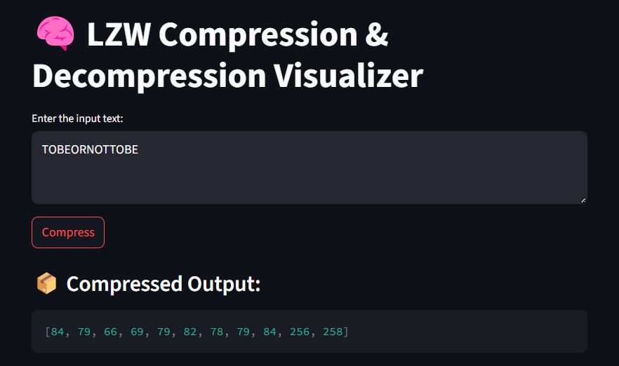
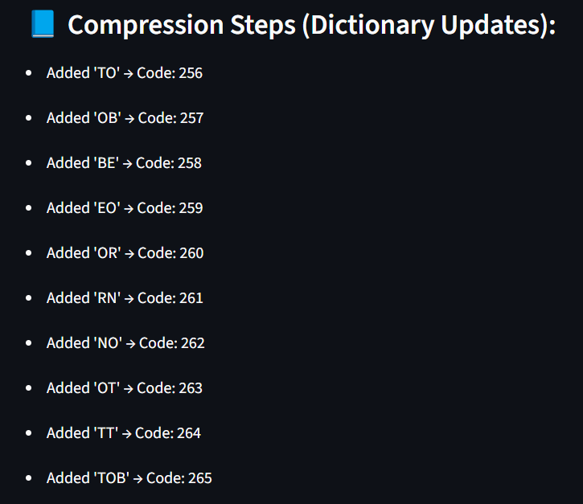
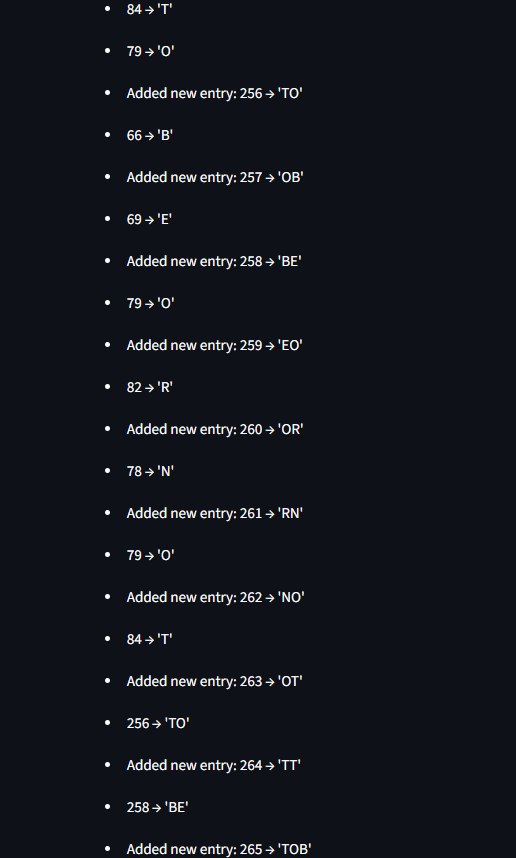

# LZW Compression Algorithm - Interactive Visualization

## Project Overview

This project is an interactive web application that implements and visualizes the **LZW (Lempel-Ziv-Welch) compression algorithm**, developed as part of the *Algorithms and Programming II* course at Fırat University, Software Engineering Department.

## Algorithm Description

### Problem Definition

This algorithm addresses the problem of **lossless data compression**. Given a string, it produces a sequence of integer codes that can later be decompressed to reproduce the original string without any data loss.

### Mathematical Background

- The algorithm builds a **dictionary-based encoding**, starting with all single characters.
- As new character sequences are encountered, they are added to the dictionary with a new unique code.
- Compression is done by replacing substrings with their corresponding codes.

### Algorithm Steps

1. **Initialize** the dictionary with all single-character entries (ASCII).
2. Read characters one by one and build the longest possible sequence found in the dictionary.
3. Output the code for the current longest match.
4. Add the new sequence (old match + new character) to the dictionary.
5. Repeat until the input is fully processed.

### Pseudocode

```plaintext
Initialize dictionary with all characters
w = ""
for each character c in input:
    if w + c is in dictionary:
        w = w + c
    else:
        output code(w)
        add w + c to dictionary
        w = c
output code(w)
```

## Complexity Analysis

### Time Complexity

- **Best Case:** O(n) — all characters are already in the dictionary
- **Average Case:** O(n) — building dictionary incrementally
- **Worst Case:** O(n) — each character leads to a new dictionary entry

### Space Complexity

- O(n) — for dictionary and output buffer

## Features

- 📥 Accepts any input string
- 📦 Compresses using LZW algorithm
- 🔍 Step-by-step dictionary building view
- 🔄 Decompresses back to original text
- ✅ Verifies if decompressed output matches the original

## Screenshots


*Main interface where user inputs the string*



*Compression and decompression steps visualized*

## Installation

### Prerequisites

- Python 3.8 or higher
- Git

### Setup Instructions

1. Clone the repository:
   ```bash
   git clone https://github.com/efeKbkci/algorithms-and-programming-ii-semester-capstone-project-efeKbkci.git
   cd algorithms-and-programming-ii-semester-capstone-project-efeKbkci
   ```

2. Create a virtual environment:
   ```bash
   python -m venv venv
   venv\Scripts\activate    # On Windows
   source venv/bin/activate # On macOS/Linux
   ```

3. Install dependencies:
   ```bash
   pip install -r requirements.txt
   ```

4. Run the application:
   ```bash
   streamlit run app.py
   ```

## Usage Guide

1. Enter a text string in the input box.
2. Click "Compress" to perform LZW compression.
3. View:
   - The compressed code output.
   - The dictionary growth steps during compression.
   - The decompressed result.
   - The correctness verification between original and decompressed strings.

### Example Inputs

- `"TOBEORNOTTOBE"` → `[84, 79, 66, 69, 79, 82, 78, 79, 84, 256, 258]`
- `"ABABABA"` → `[65, 66, 256, 258]`
- `"AAAAAAAA"` → `[65, 256, 257]`

## Implementation Details

### Key Components

- `app.py`: Main Streamlit app for compression/decompression visualization
- `algorithm.py`: Contains core LZW algorithm logic
- `test-algorithm.py`: Unit tests using `pytest`

### Code Highlights

```python
def lzw_compress(text):
    dict_size = 256
    dictionary = {chr(i): i for i in range(dict_size)}
    ...
    return compressed, steps
```

```python
def lzw_decompress(compressed):
    dictionary = {i: chr(i) for i in range(256)}
    ...
    return result, steps
```

## Testing

This project includes a test suite using `pytest` to verify the correctness of compression and decompression:

```bash
pytest test-algorithm.py
```

### Test Cases

- ✅ Known input with expected compressed output
- ✅ Repeated characters and unique character strings
- ✅ Round-trip tests (compress then decompress)

## Live Demo

Live demo : https://g4erzow3cv9ql8efnak2en.streamlit.app

## Limitations and Future Improvements

### Current Limitations

- Only supports string input (no file upload yet)
- No binary-level compression support
- Does not show dictionary as a full table

## Author

- **Name:** Efkan Efe Kabakcı
- **Student ID:** 230543007
- **GitHub:** efeKbkci
